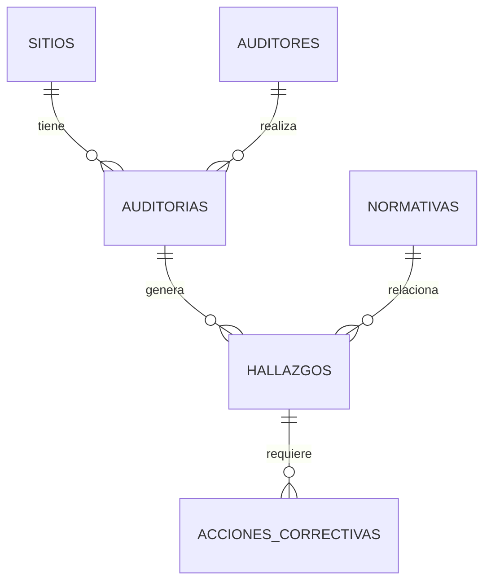

# Análisis de Cumplimiento Ambiental en la Industria Oil & Gas utilizando SQL (SQLite)

Proyecto desarrollado para demostrar habilidades en modelado de datos, SQL intermedio, análisis exploratorio y generación de métricas operativas aplicadas al ámbito ambiental, con foco en auditorías, normativa, hallazgos y acciones correctivas dentro de instalaciones Oil & Gas.

## 1. Objetivo del proyecto

Este proyecto tiene como finalidad:

- Construir desde cero una **base de datos ambiental completa** basada en un sistema de auditorías ambientales.
- Simular un flujo realista de datos: sitios, auditores, auditorías, normativas, hallazgos y acciones correctivas.
- Ejecutar consultas analíticas que respondan preguntas clave del negocio ambiental.
- Mostrar habilidades de SQL a nivel profesional.
- Permitir reproducir todo el trabajo mediante scripts y base de datos incluida.

## 2. Contexto ambiental

Como **Environmental Data Analyst**, este tipo de análisis permite:

- Identificar instalaciones críticas.
- Detectar brechas de cumplimiento normativo.
- Evaluar la eficacia del sistema de gestión ambiental.
- Priorización de riesgos por criticidad.
- Medir desempeño en cierre de hallazgos y acciones correctivas.

## 3. Estructura del repositorio
```
proyecto-sql-ambiental/
├── README.md
├── data/
│   └── database.sqlite
├── sql/
│   ├── 01_create_tables.sql
│   ├── 02_insert_data.sql
│   └── 03_queries_analisis.sql
├── docs/
│   └── diseño_esquema.md
└── assets/
    └── capturas/
```

## 4. Modelo de datos (DER)

Diagrama Entidad-Relación general del sistema utilizado:


### Relaciones principales

- Sitio 1 --- N Auditorías
- Auditor 1 --- N Auditorías
- Auditoría 1 --- N Hallazgos
- Normativa 1 --- N Hallazgos
- Hallazgo 1 --- N Acciones Correctivas

## 5. Scripts incluidos

### 01_create_tables.sql

Crea las 6 tablas del modelo con claves foráneas activadas (`PRAGMA foreign_keys = ON`), índices y comentarios estructurales.

### 02_insert_data.sql

Inserta más de **500 registros generados de forma automática**, incluyendo:

- 20 sitios
- 15 auditores
- 25 normativas
- 105 auditorías
- 200 hallazgos
- 160 acciones correctivas

### **Nota importante sobre la naturaleza de los datos:**

*Todos los datos utilizados en este proyecto son completamente simulados.*

*Aunque la estructura de la base de datos, las tablas, los criterios de auditoría y las relaciones entre entidades fueron diseñadas siguiendo prácticas reales de la industria Oil & Gas y la gestión ambiental, ningún registro corresponde a instalaciones, empresas, personas, auditorías o eventos reales.*

*El propósito del proyecto es meramente demostrar habilidades técnicas en SQL, modelado de datos y análisis ambiental, y no representa información confidencial, propietaria ni vinculada a operaciones reales.*

### 03_queries_analisis.sql

Incluye 8 consultas clave del negocio ambiental:

1. Sitios más auditados
2. Tipos de auditoría más frecuentes y evolución
3. Auditorías con más hallazgos
4. Distribución por criticidad y tipo
5. Tiempo promedio de cierre por sitio y auditor
6. Normativas más incumplidas
7. Sitios con mayor proporción de hallazgos críticos
8. Tasa de cierre anual de hallazgos

## 6. Resultados destacados

A continuación se resumen algunos de los hallazgos más relevantes del análisis SQL realizado:

### 6.1 Sitios con mayor cantidad de auditorías

Los sitios con mayor volumen de auditorías resultaron ser:

- **Pozo San Martín (Neuquén)**
- **Planta Río Verde (Chubut)**
- **Estación Norte (Neuquén)**

**Interpretación:**  
Sitios operativamente críticos o con historial relevante, que requieren mayor seguimiento.

### 6.2 Auditorías con más hallazgos

Las auditorías realizadas en sitios de tratamiento y bombeo fueron las que presentaron mayor cantidad de hallazgos, indicando:

- Procesos más complejos
- Mayor interacción con sustancias peligrosas
- Mayor probabilidad de desvíos

### 6.3 Normativas más incumplidas

Las normas con más hallazgos asociados fueron:

- **Ley 100/2005 - Gestión de Residuos Peligrosos**
- **Decreto 45/2010 - Emisiones Atmosféricas**
- **Res. 12/2012 - Efluentes Industriales**

**Interpretación:**  
Problemas comunes en la industria Oil & Gas y focos típicos de auditoría.

### 6.4 Proporción de hallazgos críticos (criticidad Alta)

Se identificaron sitios donde más del **20%** de los hallazgos son de criticidad **Alta**, lo cual indica un riesgo elevado que requiere priorización en inspecciones y cierre de acciones.

### 6.5 Tiempo de cierre de acciones correctivas

Los promedios por sitio varían ampliamente:

- Sitios con promedios cercanos a **30-45 días** → buena capacidad operativa
- Sitios con cierres > **90 días** → backlog o dificultad técnica/administrativa

## 7. Reproducción del proyecto

### Requisitos

- **DB Browser for SQLite**
- **SQLite3**
- (Opcional) Power BI para dashboards

### Pasos

1. Clonar el proyecto
2. Abrir `database.sqlite` desde `/data`
3. Si se desea recrear desde cero:  
   Ejecutar secuencialmente `01_create_tables.sql` → `02_insert_data.sql`
4. Explorar análisis desde los scripts
